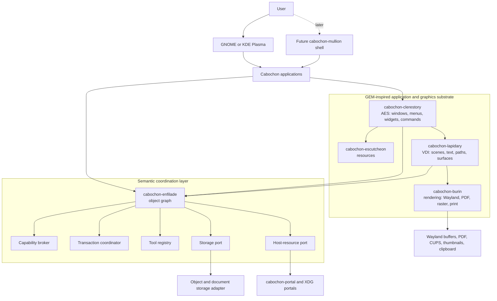

# Cabochon technical design

- **Status:** Draft
- **Audience:** Implementers, reviewers, and application developers
- **Scope:** GEM-inspired application, graphics, and document substrate with a
  hosted proving ground
- **Companion documents:** `docs/terms-of-reference.md`, `docs/context.md`,
  `docs/roadmap.md`, the ADRs indexed in `docs/contents.md`, and
  `references/cabochon-white-paper.md`
- **Last substantive revision:** 2026-07-25
- **Version:** 0.2

## 1. Design context

Cabochon's centre of gravity is the compact application environment inherited
from the Graphics Environment Manager (GEM): Clerestory for interaction,
Lapidary for device-independent graphics, Burin for rendering, and Escutcheon
for resources. Enfilade extends that substrate with semantic identity,
selectors, capabilities, and live relationships; it does not replace the
application and graphics model.

Hosted mode defers ownership of the desktop shell. It does not defer the
Cabochon application model. A hosted Cabochon application still exercises
Clerestory, Lapidary, Burin, and Escutcheon as production contracts.

Cabochon must prove its document-centred model before asking anyone to replace
a desktop environment. The initial system therefore runs as an application
runtime inside GNOME or KDE Plasma. A later Cabochon desktop can reuse the same
runtime contracts and add shell integration.

Wayland assigns rendering to clients and composition to the compositor; it does
not provide a widget or document model.[^1] XDG Desktop Portal provides secure,
defined host interactions for sandboxed applications.[^2] These boundaries make
the runtime-first split viable: Cabochon can own semantic objects and tools
without owning the display session.

The first user surface is a personal knowledge workspace containing notes,
dataframes, Mermaid diagrams, and bitmap images. The first developer exercise
creates a currency object, gives it multiple presentations, and inserts it into
a document. Both slices test the same claim: semantic identity and applicable
tools survive application boundaries. Obsidian provides the adjacent plugin-led
knowledge-workspace baseline,[^3] while Étoilé's LanguageKit provides prior art
for multiple languages sharing an object model.[^4]

## 2. Goals and non-goals

### 2.1. Goals

- Run Cabochon applications under GNOME and KDE Plasma without controlling the
  host shell.
- Establish Clerestory, Lapidary, Burin, and Escutcheon as production contracts
  in hosted mode, even while Mullion remains deferred.
- Render at least one document presentation through the same Lapidary scene
  contract to interactive display, PDF export, thumbnail, and print-oriented
  output.
- Define the minimum standard Cabochon application furniture: window, menu,
  command surface, inspector, file open and save affordances, print and export
  affordances, keyboard traversal, and accessibility roles.
- Give every persisted semantic object a stable identity independent of its
  presentation or containing application.
- Discover tools from the active object's selectors, semantic type, and
  capabilities, then present them at the point of use.
- Preserve rich embeds across Cabochon applications without flattening their
  semantics.
- Support direct Rust development and at least one more accessible authoring
  path over compatible object contracts.
- Make mutations capability checked, transactional, undoable, and auditable.
- Keep semantic object contracts independent of the graphics model without
  allowing providers to bypass the graphics model.
- Keep the runtime boundaries reusable by a future Cabochon desktop session.

### 2.2. Non-goals

- Replacing Obsidian in the initial release.
- Teaching foundational programming concepts.
- Providing organization-only policy, fleet, or compliance controls.
- Supporting document types beyond notes, dataframes, Mermaid diagrams, and
  bitmap images in the initial proving ground.
- Selecting the final compositor, GPU renderer implementation, or accessible
  dynamic language in this document. The Clerestory application contract,
  Lapidary scene contract, Burin output contract, and Escutcheon resource
  contract are in scope as architectural boundaries.
- Giving arbitrary tools ambient access to project data.

## 3. GEM-derived invariants

Cabochon is not only a semantic object environment. It is an application and
graphics environment with the following invariants:

1. Applications interact with the desktop through Clerestory, not directly
   through arbitrary host UI conventions.
2. Applications express drawings through Lapidary scenes, not through
   object-provider-specific rendering APIs.
3. Burin renders the same Lapidary intent to interactive surfaces, PDF, raster
   images, thumbnails, clipboard formats, and printer-bound output where
   supported.
4. Escutcheon owns declarative UI resources: menus, dialogs, icons, strings,
   shortcuts, command metadata, and accessibility annotations.
5. Enfilade may identify objects, discover tools, authorize selectors, and
   coordinate transactions, but it must not become the drawing model, widget
   toolkit, or layout engine.
6. Hosted mode may adapt Cabochon windows to GNOME or KDE Plasma, but Cabochon
   applications must still use the Cabochon application contract.
7. A Cabochon document must remain useful without live object automation: it
   should still render, print, export, reopen, and diagnose unavailable content.

These invariants preserve the historical GEM separation between the application
environment and device-independent graphics. Enfilade enriches the substrate;
the substrate does not dissolve into the object graph.

## 4. Design intent

Cabochon separates identity, behaviour, and presentation. Enfilade owns object
identity and semantic relationships. Providers declare typed selectors. The
runtime discovers applicable tools and checks capabilities. Applications render
presentations and submit mutations through transactions. No application owns a
semantic type merely because it first displayed it.

The design is hexagonal at the runtime boundary. Domain contracts do not depend
on a compositor, host desktop, storage engine, renderer, or authoring language.
Adapters connect those systems. This constraint prevents the hosted runtime
from becoming a temporary implementation that the full desktop later discards.

## 5. Actors and trust boundaries

| Actor                | Trust position            | Allowed responsibility                                                                      |
| -------------------- | ------------------------- | ------------------------------------------------------------------------------------------- |
| User                 | Authority source          | Grants capabilities, invokes tools, and approves sensitive mutations.                       |
| Cabochon application | Partially trusted client  | Presents objects and requests selector invocations through the runtime.                     |
| Tool provider        | Untrusted until granted   | Declares selectors and executes only with explicit capabilities.                            |
| Cabochon runtime     | Trusted session service   | Resolves identity, checks capabilities, coordinates transactions, and records audit events. |
| Host desktop         | External trusted platform | Owns windows, input, notifications, and portal presentation in hosted mode.                 |
| Portal backend       | External policy boundary  | Mediates access to files, capture, secrets, printing, and other host resources.             |
| Document content     | Untrusted input           | May contain malformed data, unknown object types, or references to unavailable sources.     |

*Table 1: Actors and trust positions.*

The runtime never treats process identity as authority to read or mutate every
object in the user's session. A selector invocation carries an object
reference, a declared selector, and capabilities scoped to the requested
operation. The runtime rejects missing, expired, or incompatible grants before
dispatch.

## 6. Architecture

The following diagram shows the two-plane topology. Cabochon applications live
on the GEM-inspired substrate — Clerestory's Application Environment Services
(AES) analogue and Lapidary's Virtual Device Interface (VDI) analogue — while
Enfilade coordinates the semantic layer beneath. The future shell uses the same
contracts rather than introducing a second object system.

For screen readers: The following flowchart shows users reaching Cabochon
applications through a host desktop now and a future Mullion shell later.
Applications sit on a GEM-inspired substrate in which Clerestory drives
Escutcheon resources and Lapidary scenes, Lapidary feeds the Burin renderer,
and Burin produces Wayland, PDF, print, thumbnail, and clipboard output.
Applications, Clerestory, and Lapidary also connect to a semantic coordination
layer in which Enfilade reaches the capability broker, transaction coordinator,
and tool registry. Enfilade reaches external storage and portal adapters only
through domain-owned storage and host-resource ports.



*Figure 1: Cabochon applications live on the GEM substrate; Enfilade enriches
them. Hosted and full-desktop modes share the same contracts.*

The runtime is a per-user session service. Applications may start it on demand
through the host's service activation mechanism. The runtime owns no top-level
windows in hosted mode. Applications use normal Wayland surfaces and host
desktop conventions. A future Cabochon shell becomes another runtime client
with compositor-specific adapters.

## 7. Domain model

### 7.1. Object identity and presentation

`ObjectId` names one semantic object for its durable lifetime. A presentation
names a view of that object for an intent, such as editing, embedding,
accessibility extraction, printing, or export. Converting a presentation never
creates a new semantic object unless the user explicitly duplicates or derives
one.

The core conceptual contracts are:

```rust,no_run
pub struct ObjectRef {
    pub id: ObjectId,
    pub revision: Revision,
    pub capabilities: CapabilitySet,
}

pub trait ObjectProvider {
    fn describe(&self, object: &ObjectRef) -> Result<ObjectDescriptor, ObjectError>;
    fn invoke(&self, request: Invocation) -> Result<InvocationResult, ObjectError>;
}

pub struct Invocation {
    pub target: ObjectRef,
    pub selector: SelectorId,
    pub arguments: ValueMap,
    pub transaction: Option<TransactionId>,
}
```

These signatures define responsibilities, not an accepted Rust API. The final
wire and language bindings require ADRs. The runtime resolves the selector's
mutability classification before provider dispatch. When the selector mutates,
`transaction` must contain a valid transaction identifier; the runtime rejects
a missing, unknown, or inactive transaction without invoking the provider.
Read-only selectors may omit the field. This validation belongs to the runtime
dispatch boundary even when a future binding uses separate query and mutation
request types to make the requirement structural.

A presentation is a boundary object. Enfilade may resolve which presentation
applies to an object and intent, but Clerestory, Lapidary, and Burin define how
that presentation becomes an interactive view, geometric scene, exported
document, print job, clipboard geometry, or accessibility geometry.

A provider must not smuggle toolkit-specific or renderer-specific state through
object descriptors. Geometry, drawing, text, and output intent belong to
Lapidary. Commands, focus, menus, dialogs, and interaction affordances belong
to Clerestory.

### 7.2. Selectors and tools

A selector declaration contains a stable identifier, typed arguments, result
shape, mutability classification, required capabilities, and presentation
metadata. A tool groups one or more selector invocations into a user-facing
capability. Applicability is a query over declarations, not a menu assembled by
application name.

For example, a formula tool can advertise that it accepts any object exposing
numeric or currency-valued selectors. A document application asks the runtime
for tools applicable to the selection. The runtime returns only tools whose
requirements match and whose providers are available. The application places
those tools next to the selection or in its normal contextual command surface.

### 7.3. Embeds and live relationships

An embed stores an `ObjectId`, presentation intent, layout parameters, and an
optional live relationship. It does not store a rendered screenshot as the
source of truth. Cached renderings may accelerate display, but the object
reference remains authoritative.

A live relationship records its source objects, selector, arguments, last
successful source revisions, and last successful result. ADR 005 establishes
current, refreshing, stale, broken, and denied safety states. Refresh triggers,
retry timing, source-move resolution, and the detailed transition matrix remain
unresolved. Implementations must expose state explicitly and must never replace
the last successful value with silent corruption.

### 7.4. Transactions and undo

Every mutating selector executes inside a transaction. A transaction records
the target revisions it read, the capabilities it used, its mutation set, and
the inverse or compensating operation required for undo. Commit succeeds only
when the target revisions still match or the provider performs a declared,
deterministic merge.

The runtime groups cross-object mutations into one transaction where every
provider supports prepare and commit. Otherwise it rejects the operation before
mutation. Partial success without a visible recovery state is forbidden.

## 8. Cabochon component responsibilities

### 8.1. Clerestory application environment

Clerestory owns the Cabochon application contract: windows, menus, dialogs,
command routing, focus, keyboard traversal, drag-and-drop, clipboard
integration, standard panels, accessibility roles, and host-shell adaptation.
It presents Enfilade-discovered tools through normal application surfaces, but
tool discovery does not define the UI model.

In hosted mode, Clerestory maps Cabochon application surfaces onto the host
desktop. In a future full desktop, it maps them onto Mullion. The application
contract must remain the same across both modes.

### 8.2. Escutcheon resource system

Escutcheon compiles declarative resources for Clerestory applications: menus,
dialogs, icons, strings, accelerators, command metadata, inspector layouts, and
accessibility annotations. Resources are textual, versionable, localizable, and
testable.

Cabochon applications must be able to define useful UI without writing
rendering code or object-graph plumbing for ordinary desktop furniture.

### 8.3. Lapidary virtual device interface

Lapidary owns Cabochon's device-independent graphics model. Applications and
presentation providers describe paths, text runs, images, clipping, transforms,
layers, hit regions, annotations, colour intent, page geometry, and output
intent through Lapidary scenes. Lapidary is the modern analogue of GEM's VDI,
as Clerestory is of its AES.

Lapidary is not Enfilade. An object may choose or provide a presentation, but
the presentation must cross into the graphics world through a Lapidary contract
when Cabochon renders, prints, exports, thumbnails, or exposes geometry for
accessibility.

### 8.4. Burin renderer

Burin turns Lapidary scenes into concrete output: Wayland buffers, software
fallbacks, PDF, SVG where appropriate, raster images, thumbnails, clipboard
formats, and CUPS-bound print output. Rendering failure must never corrupt
object identity or silently flatten semantic content.

### 8.5. Enfilade object graph

Enfilade resolves object identifiers, revisions, selectors, semantic links, and
provider locations. It owns graph integrity, not object-specific business
logic. Providers validate their own values and mutations.

Enfilade persists unknown object descriptors and relationships without
discarding them. An unavailable provider makes an object opaque but does not
erase its identity or links. This rule permits documents to survive temporary
tool removal and future schema evolution.

### 8.6. Capability broker

The capability broker issues narrow grants after user intent or a trusted
policy decision. Grants identify subject, target scope, selectors, access mode,
and expiry. Unbounded paths, raw user input, and document titles never become
authorization labels.

Host-resource access crosses XDG portals where a suitable portal exists. The
runtime does not bypass the host merely because the user has installed
Cabochon.[^2]

### 8.7. Tool registry

The tool registry indexes selector declarations and availability. It answers
applicability queries using semantic contracts and capability requirements.
Registration does not grant access. Discovery and authority remain separate.

### 8.8. Transaction coordinator

The coordinator provides optimistic revision checks, prepare/commit for
multi-object mutations, undo metadata, and an audit record. Providers that
cannot participate in atomic multi-object transactions may expose read-only
selectors or single-object mutations only.

Before dispatch, the coordinator validates that a mutating selector names an
active transaction. A request without one fails before provider code runs or
state changes. The provider then receives only a transaction-bound mutation.

### 8.9. Presentation broker

The presentation broker chooses a provider for an object and intent, then
returns a presentation contract to the requesting application. Rendering
adapters may target interactive Wayland content, accessibility trees, PDF, SVG,
raster images, thumbnails, clipboard geometry, or printing. Every target
consumes the same device-independent Lapidary scene and Burin output contracts.
Screen rendering is one intent, not the object model's centre of gravity.

### 8.10. Portal adapter

The portal adapter mediates host-resource access — file selection, capture,
secrets, notifications, and printing — through XDG Desktop Portal interfaces
where a suitable portal exists.[^2] Clerestory may initiate a request or
explain why it is needed, but the external portal backend owns and presents the
authoritative permission prompt. The adapter records resulting grants with the
capability broker, so portal decisions become inspectable capabilities rather
than ambient authority.

## 9. Initial vertical slices

### 9.1. Currency object in a resource-defined Cabochon window

The first slice creates a currency object with a base-currency identity, at
least two currency presentations, and a document embed. It must run inside a
Clerestory window whose menu, commands, strings, and basic layout come from
Escutcheon resources.

At least one currency presentation must render through a Lapidary scene and
Burin output path. The slice must produce an interactive view, a thumbnail, and
a PDF-oriented export from the same presentation contract.

This proves object identity, selector declaration, presentation choice,
document insertion, resource-defined UI, and device-independent rendering
without requiring the full knowledge workspace or full desktop shell.

The exercise must work through a developer-facing authoring path that does not
require Rust knowledge. A parallel Rust implementation must demonstrate that
the accessible path does not define a separate object universe. The authoring
path remains an ADR-backed spike.

### 9.2. Knowledge workspace

The second slice delivers interconnected notes containing dataframe, Mermaid,
and bitmap objects. Each object has a focused editor, but a document can embed
and retain the object across editor boundaries. The slice proves that
applications cooperate through semantic contracts rather than shared process
memory.

The knowledge workspace must export a selected note or note collection through
a page-oriented Lapidary presentation. The export path must support headings,
text, embedded dataframe or diagram presentations, bitmap placement, page
geometry, and a visible diagnostic for unavailable providers.

This requirement does not turn the initial release into a desktop-publishing
package. It ensures the proving ground exercises Cabochon's device-independent
graphics and print and export contracts.

### 9.3. Formula tool

The formula tool calculates over addressable values exposed by document
entities, dataframe cells, or SVG elements. It appears where compatible objects
are selected. This slice proves tool discovery, cross-object references, live
relationships, capability checks, and transaction behaviour.

## 10. Storage and evolution

The object store persists envelopes separately from provider-owned payloads. An
envelope contains identity, type identifier, schema version, revision, selector
metadata digest, links, and payload location. Providers own payload validation
and migration.

Migrations must be monotonic and crash safe. The runtime retains the previous
payload until the provider commits the migrated value. Unknown fields and
unknown object types survive round trips. Documents never delete an embed
because its provider is absent.

Project export must include every owned object envelope, payload, relationship,
and capability-independent presentation hint required to reconstruct the
project. Capability grants and host-specific secrets do not travel with the
export.

## 11. Failure behaviour

| Failure                      | Required behaviour                                                                                           |
| ---------------------------- | ------------------------------------------------------------------------------------------------------------ |
| Tool provider unavailable    | Keep the object and last successful presentation; mark the tool unavailable.                                 |
| Unknown object type          | Preserve identity, payload, and links; present an opaque-object diagnostic.                                  |
| Source revision conflict     | Reject commit or perform a provider-declared deterministic merge.                                            |
| Capability denied or expired | Do not invoke the provider; explain the required access at the point of use.                                 |
| Mutation lacks a transaction | Do not invoke the provider; return a transaction-required diagnostic.                                        |
| Live source unavailable      | Preserve the last successful value and expose the state required by ADR 005.                                 |
| Renderer failure             | Fall back only to a semantically valid alternate presentation; otherwise show a bounded diagnostic.          |
| Runtime restart              | Recover committed objects and transactions; discard uncommitted prepares without exposing partial mutations. |
| Malformed document           | Isolate the invalid object, preserve recoverable siblings, and produce location-aware diagnostics.           |

*Table 2: Required failure behaviour.*

## 12. Security model

Protected assets include document content, object relationships, credentials,
clipboard data, host files, capture streams, and mutation authority. Attackers
may supply malicious documents, tools, providers, or selector arguments.

The security invariants are:

1. Discovery never grants authority.
2. A selector cannot access objects outside the invocation's capability set.
3. A denied invocation performs no mutation.
4. A failed multi-object transaction exposes either the previous committed
   state or an explicit recovery state, never an invented success.
5. Project export excludes capabilities and host secrets.

The runtime records selector identifier, target object, provider, decision,
transaction identifier, and bounded error classification in structured tracing
events. It never records raw document content, credentials, or unbounded paths
as metric labels.

## 13. Verification strategy

The object graph and transaction coordinator carry correctness properties that
example tests cannot cover alone.

- Property-based tests generate object graphs, provider availability changes,
  schema versions, and export/import cycles. The invariant is that every
  reachable object and unknown field survives a round trip with the same
  identity.
- A bounded state-machine model covers prepare, commit, abort, provider crash,
  and runtime restart. The invariant is that no failed transaction exposes a
  partially committed object set.
- Capability tests generate selector, target, expiry, and delegation
  combinations. The invariant is that successful invocation authority is a
  subset of the presented grant.
- Dispatch contract tests pair selector mutability with absent, unknown,
  inactive, and active transaction identifiers. Every mutating case without an
  active transaction must fail before the provider records an invocation.
- End-to-end suites exercise hosted GNOME-like and KDE-like environments, the
  future Cabochon shell adapter, provider absence, and sandboxed versus
  unsandboxed applications. Pairwise coverage is insufficient for capability
  and mutation combinations; high-risk denial, crash, and restart triples need
  explicit cases.

Formal proof is not required for the initial slices. If the transaction model
admits ambiguous recovery states during the bounded-model spike, the design
must narrow the protocol or introduce a proof obligation before implementation
continues.

### 13.1. VDI conformance tests

Lapidary and Burin require contract tests independent of Enfilade.

- Scene round-trip tests preserve paths, text runs, images, clipping,
  transforms, layers, hit regions, colour intent, units, and output intent.
- Output parity tests render the same scene to interactive display,
  PDF-oriented output, raster export, thumbnail, print-oriented output, and
  accessibility and clipboard geometry extraction, then compare geometry and
  metadata within declared tolerances.
- Invalidation tests ensure damage regions and clipping never expose stale
  pixels or redraw outside the declared region.
- Text tests cover shaping, bidirectional text, font fallback, grapheme-aware
  caret geometry, and accessibility text extraction.
- Failure tests ensure renderer errors produce bounded diagnostics and never
  mutate object identity, flatten semantic embeds, or silently drop content.

## 14. Observability

The runtime emits structured spans for discovery queries, selector invocation,
capability decisions, transaction phases, provider activation, migrations, and
presentation rendering. Low-cardinality metrics cover invocation outcomes,
provider availability, transaction latency, abort classification, stale live
relationships, and rendering failures.

Applications install no global subscriber or metrics recorder on behalf of the
runtime. The session service owns runtime instrumentation initialization;
libraries only emit events and metrics.

## 15. Decisions and open questions

| Decision                                   | Status                                                                 | Resolution path                                                                                     |
| ------------------------------------------ | ---------------------------------------------------------------------- | --------------------------------------------------------------------------------------------------- |
| Product scope                              | Decided: prove the hosted runtime before a full desktop                | [ADR 001](adr-001-runtime-first-product-scope.md).                                                  |
| Runtime versus full-desktop boundary       | Decided: one runtime contract supports hosted and shell modes          | [ADR 002](adr-002-hosted-runtime-boundary.md).                                                      |
| Object identity versus presentation        | Decided: identity is stable across presentations and applications      | Record as an ADR with persistence consequences.                                                     |
| Tool discovery versus capability grant     | Decided: discovery never grants authority                              | [ADR 003](adr-003-runtime-security-boundary.md).                                                    |
| Initial document types                     | Decided: notes, dataframes, Mermaid diagrams, and bitmap images        | Enforce through roadmap scope.                                                                      |
| Developer authoring paths                  | Boundary decided; accessible path open                                 | [ADR 004](adr-004-interoperable-authoring-paths.md); use spikes to choose the accessible path.      |
| Live relationship lifecycle                | Safety contract decided; transition details open                       | [ADR 005](adr-005-explicit-live-relationship-states.md); validate transitions against later slices. |
| Runtime wire protocol                      | Open                                                                   | Prototype in-process and local inter-process contracts without changing domain identifiers.         |
| Storage engine and payload format          | Open                                                                   | Exercise migration, unknown-type preservation, and project export before selection.                 |
| GEM substrate boundary                     | Accepted: substrate contracts are production boundaries in hosted mode | [ADR 006](adr-006-gem-substrate-boundary.md).                                                       |
| Rendering authority                        | Accepted: Enfilade resolves applicability but never owns rendering     | [ADR 007](adr-007-enfilade-rendering-authority.md).                                                 |
| Compositor and GPU renderer implementation | Deferred                                                               | Decide only when the hosted proving ground establishes product value.                               |

*Table 3: Design decisions and resolution paths.*

## 16. References

[^1]: [Wayland architecture](https://wayland.freedesktop.org/architecture.html),
    accessed 9 July 2026.
[^2]: [XDG Desktop Portal
    documentation](https://flatpak.github.io/xdg-desktop-portal/docs/), accessed
    9 July 2026.
[^3]: [Building an Obsidian
    plugin](https://docs.obsidian.md/Plugins/Getting+started/Build+a+plugin),
    accessed 10 July 2026.
[^4]: [Étoilé LanguageKit](https://etoileos.com/etoile/features/languagekit/),
    accessed 10 July 2026.
