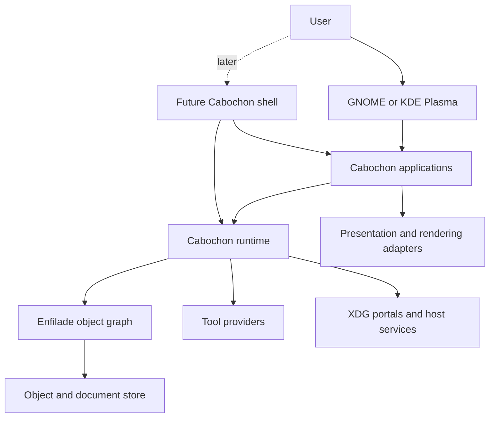

# Cabochon technical design

- **Status:** Draft
- **Audience:** Implementers, reviewers, and application developers
- **Scope:** Runtime-first semantic document environment and initial proving
  ground
- **Companion documents:** `docs/terms-of-reference.md`, `docs/context.md`,
  `docs/roadmap.md`, and `references/cabochon-white-paper.md`
- **Last substantive revision:** 2026-07-10
- **Version:** 0.1

## 1. Design context

Cabochon must prove its document-centred model before asking anyone to replace
a desktop environment. The initial system therefore runs as an application
runtime inside GNOME or KDE Plasma. A later Cabochon desktop can reuse the same
runtime contracts and add shell integration.

Wayland assigns rendering to clients and composition to the compositor; it does
not provide a widget or document model.[^1] XDG Desktop Portal provides secure,
defined host interactions for sandboxed applications.[^2] These boundaries make
the runtime-first split viable: Cabochon can own semantic objects and tools
without owning the display session.

The first user surface is a personal knowledge workspace containing notes,
dataframes, Mermaid diagrams, and bitmap images. The first developer exercise
creates a currency object, gives it multiple presentations, and inserts it into
a document. Both slices test the same claim: semantic identity and applicable
tools survive application boundaries. Obsidian provides the adjacent plugin-led
knowledge-workspace baseline,[^3] while Étoilé's LanguageKit provides prior art
for multiple languages sharing an object model.[^4]

## 2. Goals and non-goals

### 2.1. Goals

- Run Cabochon applications under GNOME and KDE Plasma without controlling the
  host shell.
- Give every persisted semantic object a stable identity independent of its
  presentation or containing application.
- Discover tools from the active object's selectors, semantic type, and
  capabilities, then present them at the point of use.
- Preserve rich embeds across Cabochon applications without flattening their
  semantics.
- Support direct Rust development and at least one more accessible authoring
  path over compatible object contracts.
- Make mutations capability checked, transactional, undoable, and auditable.
- Keep the runtime boundaries reusable by a future Cabochon desktop session.

### 2.2. Non-goals

- Replacing Obsidian in the initial release.
- Teaching foundational programming concepts.
- Providing organization-only policy, fleet, or compliance controls.
- Supporting document types beyond notes, dataframes, Mermaid diagrams, and
  bitmap images in the initial proving ground.
- Selecting the final compositor, rendering engine, widget toolkit, or dynamic
  language in this document.
- Giving arbitrary tools ambient access to project data.

## 3. Design intent

Cabochon separates identity, behaviour, and presentation. Enfilade owns object
identity and semantic relationships. Providers declare typed selectors. The
runtime discovers applicable tools and checks capabilities. Applications render
presentations and submit mutations through transactions. No application owns a
semantic type merely because it first displayed it.

The design is hexagonal at the runtime boundary. Domain contracts do not depend
on a compositor, host desktop, storage engine, renderer, or authoring language.
Adapters connect those systems. This constraint prevents the hosted runtime
from becoming a temporary implementation that the full desktop later discards.

## 4. Actors and trust boundaries

| Actor                | Trust position            | Allowed responsibility                                                                      |
| -------------------- | ------------------------- | ------------------------------------------------------------------------------------------- |
| User                 | Authority source          | Grants capabilities, invokes tools, and approves sensitive mutations.                       |
| Cabochon application | Partially trusted client  | Presents objects and requests selector invocations through the runtime.                     |
| Tool provider        | Untrusted until granted   | Declares selectors and executes only with explicit capabilities.                            |
| Cabochon runtime     | Trusted session service   | Resolves identity, checks capabilities, coordinates transactions, and records audit events. |
| Host desktop         | External trusted platform | Owns windows, input, notifications, and portal presentation in hosted mode.                 |
| Portal backend       | External policy boundary  | Mediates access to files, capture, secrets, printing, and other host resources.             |
| Document content     | Untrusted input           | May contain malformed data, unknown object types, or references to unavailable sources.     |

*Table 1: Actors and trust positions.*

The runtime never treats process identity as authority to read or mutate every
object in the user's session. A selector invocation carries an object
reference, a declared selector, and capabilities scoped to the requested
operation. The runtime rejects missing, expired, or incompatible grants before
dispatch.

## 5. Architecture

The following diagram shows the runtime-first topology. The future shell uses
the same runtime rather than introducing a second object system.



*Figure 1: Hosted and full-desktop modes share one runtime contract.*

The runtime is a per-user session service. Applications may start it on demand
through the host's service activation mechanism. The runtime owns no top-level
windows in hosted mode. Applications use normal Wayland surfaces and host
desktop conventions. A future Cabochon shell becomes another runtime client
with compositor-specific adapters.

## 6. Domain model

### 6.1. Object identity and presentation

`ObjectId` names one semantic object for its durable lifetime. A presentation
names a view of that object for an intent, such as editing, embedding,
accessibility extraction, printing, or export. Converting a presentation never
creates a new semantic object unless the user explicitly duplicates or derives
one.

The core conceptual contracts are:

```rust,no_run
pub struct ObjectRef {
    pub id: ObjectId,
    pub revision: Revision,
    pub capabilities: CapabilitySet,
}

pub trait ObjectProvider {
    fn describe(&self, object: &ObjectRef) -> Result<ObjectDescriptor, ObjectError>;
    fn invoke(&self, request: Invocation) -> Result<InvocationResult, ObjectError>;
}

pub struct Invocation {
    pub target: ObjectRef,
    pub selector: SelectorId,
    pub arguments: ValueMap,
    pub transaction: Option<TransactionId>,
}
```

These signatures define responsibilities, not an accepted Rust API. The final
wire and language bindings require ADRs.

### 6.2. Selectors and tools

A selector declaration contains a stable identifier, typed arguments, result
shape, mutability classification, required capabilities, and presentation
metadata. A tool groups one or more selector invocations into a user-facing
capability. Applicability is a query over declarations, not a menu assembled by
application name.

For example, a formula tool can advertise that it accepts any object exposing
numeric or currency-valued selectors. A document application asks the runtime
for tools applicable to the selection. The runtime returns only tools whose
requirements match and whose providers are available. The application places
those tools next to the selection or in its normal contextual command surface.

### 6.3. Embeds and live relationships

An embed stores an `ObjectId`, presentation intent, layout parameters, and an
optional live relationship. It does not store a rendered screenshot as the
source of truth. Cached renderings may accelerate display, but the object
reference remains authoritative.

A live relationship records its source objects, selector, arguments, last
successful source revisions, and last successful result. The final refresh,
staleness, broken-link, and authorization behaviour is unresolved. Until an ADR
settles it, implementations must expose state explicitly and must never replace
the last successful value with silent corruption.

### 6.4. Transactions and undo

Every mutating selector executes inside a transaction. A transaction records
the target revisions it read, the capabilities it used, its mutation set, and
the inverse or compensating operation required for undo. Commit succeeds only
when the target revisions still match or the provider performs a declared,
deterministic merge.

The runtime groups cross-object mutations into one transaction where every
provider supports prepare and commit. Otherwise it rejects the operation before
mutation. Partial success without a visible recovery state is forbidden.

## 7. Runtime component responsibilities

### 7.1. Enfilade object graph

Enfilade resolves object identifiers, revisions, selectors, semantic links, and
provider locations. It owns graph integrity, not object-specific business
logic. Providers validate their own values and mutations.

Enfilade persists unknown object descriptors and relationships without
discarding them. An unavailable provider makes an object opaque but does not
erase its identity or links. This rule permits documents to survive temporary
tool removal and future schema evolution.

### 7.2. Capability broker

The capability broker issues narrow grants after user intent or a trusted
policy decision. Grants identify subject, target scope, selectors, access mode,
and expiry. Unbounded paths, raw user input, and document titles never become
authorization labels.

Host-resource access crosses XDG portals where a suitable portal exists. The
runtime does not bypass the host merely because the user has installed
Cabochon.[^2]

### 7.3. Tool registry

The tool registry indexes selector declarations and availability. It answers
applicability queries using semantic contracts and capability requirements.
Registration does not grant access. Discovery and authority remain separate.

### 7.4. Transaction coordinator

The coordinator provides optimistic revision checks, prepare/commit for
multi-object mutations, undo metadata, and an audit record. Providers that
cannot participate in atomic multi-object transactions may expose read-only
selectors or single-object mutations only.

### 7.5. Presentation broker

The presentation broker chooses a provider for an object and intent, then
returns a presentation contract to the requesting application. Rendering
adapters may target interactive Wayland content, accessibility trees, PDF, SVG,
raster images, thumbnails, or printing. Screen rendering is one intent, not the
object model's centre of gravity.

## 8. Initial vertical slices

### 8.1. Currency object developer exercise

The first slice creates a currency object with a base-currency identity, at
least two currency presentations, and a document embed. It proves object
identity, selector declaration, presentation choice, and document insertion
without requiring the full knowledge workspace.

The exercise must work through a developer-facing authoring path that does not
require Rust knowledge. A parallel Rust implementation must demonstrate that
the accessible path does not define a separate object universe. The authoring
path remains an ADR-backed spike.

### 8.2. Knowledge workspace

The second slice delivers interconnected notes containing dataframe, Mermaid,
and bitmap objects. Each object has a focused editor, but a document can embed
and retain the object across editor boundaries. The slice proves that
applications cooperate through semantic contracts rather than shared process
memory.

### 8.3. Formula tool

The formula tool calculates over addressable values exposed by document
entities, dataframe cells, or SVG elements. It appears where compatible objects
are selected. This slice proves tool discovery, cross-object references, live
relationships, capability checks, and transaction behaviour.

## 9. Storage and evolution

The object store persists envelopes separately from provider-owned payloads. An
envelope contains identity, type identifier, schema version, revision, selector
metadata digest, links, and payload location. Providers own payload validation
and migration.

Migrations must be monotonic and crash safe. The runtime retains the previous
payload until the provider commits the migrated value. Unknown fields and
unknown object types survive round trips. Documents never delete an embed
because its provider is absent.

Project export must include every owned object envelope, payload, relationship,
and capability-independent presentation hint required to reconstruct the
project. Capability grants and host-specific secrets do not travel with the
export.

## 10. Failure behaviour

| Failure                      | Required behaviour                                                                                           |
| ---------------------------- | ------------------------------------------------------------------------------------------------------------ |
| Tool provider unavailable    | Keep the object and last successful presentation; mark the tool unavailable.                                 |
| Unknown object type          | Preserve identity, payload, and links; present an opaque-object diagnostic.                                  |
| Source revision conflict     | Reject commit or perform a provider-declared deterministic merge.                                            |
| Capability denied or expired | Do not invoke the provider; explain the required access at the point of use.                                 |
| Live source unavailable      | Preserve the last successful value and expose explicit stale state pending the live-link ADR.                |
| Renderer failure             | Fall back only to a semantically valid alternate presentation; otherwise show a bounded diagnostic.          |
| Runtime restart              | Recover committed objects and transactions; discard uncommitted prepares without exposing partial mutations. |
| Malformed document           | Isolate the invalid object, preserve recoverable siblings, and produce location-aware diagnostics.           |

*Table 2: Required failure behaviour.*

## 11. Security model

Protected assets include document content, object relationships, credentials,
clipboard data, host files, capture streams, and mutation authority. Attackers
may supply malicious documents, tools, providers, or selector arguments.

The security invariants are:

1. Discovery never grants authority.
2. A selector cannot access objects outside the invocation's capability set.
3. A denied invocation performs no mutation.
4. A failed multi-object transaction exposes either the previous committed
   state or an explicit recovery state, never an invented success.
5. Project export excludes capabilities and host secrets.

The runtime records selector identifier, target object, provider, decision,
transaction identifier, and bounded error classification in structured tracing
events. It never records raw document content, credentials, or unbounded paths
as metric labels.

## 12. Verification strategy

The object graph and transaction coordinator carry correctness properties that
example tests cannot cover alone.

- Property-based tests generate object graphs, provider availability changes,
  schema versions, and export/import cycles. The invariant is that every
  reachable object and unknown field survives a round trip with the same
  identity.
- A bounded state-machine model covers prepare, commit, abort, provider crash,
  and runtime restart. The invariant is that no failed transaction exposes a
  partially committed object set.
- Capability tests generate selector, target, expiry, and delegation
  combinations. The invariant is that successful invocation authority is a
  subset of the presented grant.
- End-to-end suites exercise hosted GNOME-like and KDE-like environments, the
  future Cabochon shell adapter, provider absence, and sandboxed versus
  unsandboxed applications. Pairwise coverage is insufficient for capability
  and mutation combinations; high-risk denial, crash, and restart triples need
  explicit cases.

Formal proof is not required for the initial slices. If the transaction model
admits ambiguous recovery states during the bounded-model spike, the design
must narrow the protocol or introduce a proof obligation before implementation
continues.

## 13. Observability

The runtime emits structured spans for discovery queries, selector invocation,
capability decisions, transaction phases, provider activation, migrations, and
presentation rendering. Low-cardinality metrics cover invocation outcomes,
provider availability, transaction latency, abort classification, stale live
relationships, and rendering failures.

Applications install no global subscriber or metrics recorder on behalf of the
runtime. The session service owns runtime instrumentation initialization;
libraries only emit events and metrics.

## 14. Decisions and open questions

| Decision                               | Status                                                            | Resolution path                                                                                             |
| -------------------------------------- | ----------------------------------------------------------------- | ----------------------------------------------------------------------------------------------------------- |
| Runtime versus full-desktop boundary   | Decided: one runtime contract supports hosted and shell modes     | Record as an ADR before crate extraction.                                                                   |
| Object identity versus presentation    | Decided: identity is stable across presentations and applications | Record as an ADR with persistence consequences.                                                             |
| Tool discovery versus capability grant | Decided: discovery never grants authority                         | Record as a security ADR.                                                                                   |
| Initial document types                 | Decided: notes, dataframes, Mermaid diagrams, and bitmap images   | Enforce through roadmap scope.                                                                              |
| Developer authoring paths              | Open                                                              | Prototype Rust, Objective Rust, and one dynamic-language route; compare continuity and first-result effort. |
| Live relationship lifecycle            | Open                                                              | Specify refresh, stale, broken, moved, and denied states in an ADR.                                         |
| Runtime wire protocol                  | Open                                                              | Prototype in-process and local inter-process contracts without changing domain identifiers.                 |
| Storage engine and payload format      | Open                                                              | Exercise migration, unknown-type preservation, and project export before selection.                         |
| Compositor, renderer, and toolkit      | Deferred                                                          | Decide only when the hosted proving ground establishes product value.                                       |

*Table 3: Design decisions and resolution paths.*

## 15. References

[^1]: [Wayland architecture](https://wayland.freedesktop.org/architecture.html),
    accessed 9 July 2026.
[^2]: [XDG Desktop Portal
    documentation](https://flatpak.github.io/xdg-desktop-portal/docs/), accessed
    9 July 2026.
[^3]: [Building an Obsidian
    plugin](https://docs.obsidian.md/Plugins/Getting+started/Build+a+plugin),
    accessed 10 July 2026.
[^4]: [Étoilé LanguageKit](https://etoileos.com/etoile/features/languagekit/),
    accessed 10 July 2026.
